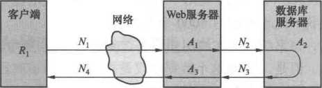
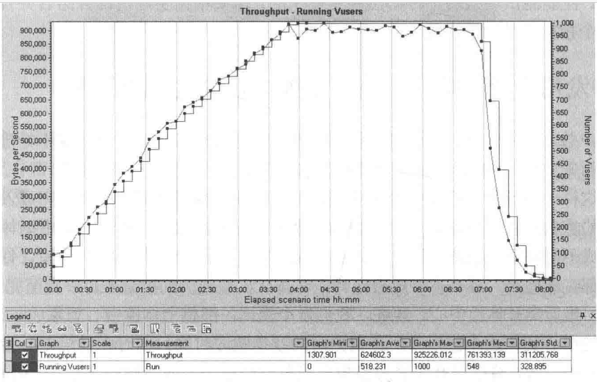

<!-- vscode-markdown-toc -->
* 1. [性能测试](#)
	* 1.1. [理论基础](#-1)
		* 1.1.1. [1、角色](#-1)
		* 1.1.2. [1)从终端用户](#-1)
		* 1.1.3. [2）从系统运维人员](#-1)
		* 1.1.4. [3）从软件开发人员](#-1)
		* 1.1.5. [4）从性能测试人员](#-1)
	* 1.2. [2、常用指标](#-1)
		* 1.2.1. [（1）并发用户数](#1)
		* 1.2.2. [（2）  响应时间](#2)
		* 1.2.3. [（3） 系统吞吐量](#3)
		* 1.2.4. [(4)  并发用户数、响应时间、系统吞吐量之间的关系](#4)
	* 1.3. [后端性能测试工具](#-1)
	* 1.4. [前端性能测试工具](#-1)
* 2. [能力值](#-1)
	* 2.1. [Spring Boot](#SpringBoot)
	* 2.2. [Docker](#Docker)
	* 2.3. [Jenkins](#Jenkins)
	* 2.4. [引入主从分离的数据库](#-1)
	* 2.5. [基于消息队列的分布式系统测试设计](#-1)
	* 2.6. [网站架构](#-1)
	* 2.7. [网站高性能架构设计](#-1)
	* 2.8. [网站高可用架构设计](#-1)
	* 2.9. [网站可伸缩性架构设计](#-1)
	* 2.10. [网站可扩展性架构设计](#-1)
* 3. [工具](#-1)
	* 3.1. [初级工具](#-1)
	* 3.2. [中级工具](#-1)

<!-- vscode-markdown-toc-config
	numbering=true
	autoSave=true
	/vscode-markdown-toc-config -->
<!-- /vscode-markdown-toc -->
# ArtOfTesting


##  1. <a name=''></a>性能测试

###  1.1. <a name='-1'></a>理论基础

####  1.1.1. <a name='-1'></a>1、角色

####  1.1.2. <a name='-1'></a>1)从终端用户

- 系统响应时间

  - 系统能力
    - 应用系统处理时间
    - 数据库处理时间
    - 网络传输时间

- 前端展现时间
  - 用户端处理能力

<br/>

####  1.1.3. <a name='-1'></a>2）从系统运维人员

- 单个用户的响应时间
  - 大量用户并发访问的负载
    - 系统健康状态
    - 并发处理能力
    - 当前部署的系统容量
    - 可能的系统瓶颈
    - 系统配置层面的调优
    - 数据库调优
    - 长时间运行的稳定性
    - 可扩展性

- 用户意见

  - 相同
    - 响应时间

  - 对立

    - 引入等待机制，牺牲响应时间，增加系统容量，如购票排队

####  1.1.4. <a name='-1'></a>3）从软件开发人员

- 性能工程

  - 算法设计

    - 核心算法的设计与实现是否高效
    - 必要时，设计上是否采用缓冲区机制以提高性能
    - 是否存在潜在的内存泄露
    - 是否存在并发环境下的线程安全问题
    - 是否存在不合理的线程同步方式
    - 是否存在不合理的资源竞争

  - 架构设计

    - 系统的整体是否可以方便地进行容量和性能扩展
    - 应用集群的可扩展性是否经过测试和验证
    - 缓存集群的可扩展性是否经过测试和验证
    - 数据库的可扩展性是否经过测试和验证

  - 性能实践

    - 代码实现是否遵守开发语言的性能实践
    - 关键代码是否在白盒级别进行性能测试
    - 是否考虑前端性能的优化
    - 必要的时候是否压缩数据
    - 对于既要压缩又要加密的场景，是否采用先压缩后加密的顺序

  - 数据库

    - 数据库表设计是否高效
    - 是否引入必要的索引
    - SQL语句的执行计划是否合理
    - SQL语句除了功能之外是否要考虑性能要求
    - 数据库是否需要引入读写分离机制
    - 系统冷启动后，当缓存大量不命中的时候，数据库承载的压力是否超负荷

  - 软件性能的可测性

    - 是否为性能分析器提供必要的接口支持
    - 是否支持高并发场景下的性能打点
    - 是否支持全链路的性能分析

  - 协作完成

    - 系统部署级别的性能

    - 目标操作系统的调优
    - 应用服务器的参数调优
    - 数据库的参数调优
    - 网络环境的调优

####  1.1.5. <a name='-1'></a>4）从性能测试人员

- 性能测试人员既要能够准确把握软 件的性能需求，又要能够准确定位造成性能低下的因素和根源，并提出相应的解决方案
 
  - 能力要求

   - 性能需求的总结和抽象能力
   - 根据性能测试目标，精准的性能测试场景设计和计算能力
   - 性能测试场景和性能测试脚本的开发与执行能力
   - 性能测试报告的分析解读能力
   - 性能瓶颈的快速排查和定位能力
   - 性能测试数据的设计和实现能力
   - 面对互联网产品，全链路压测的设计与执行能力，能够和系统架构师一起处理流量标记、影子数据库等的技术设计能力
   - 深入理解性能测试工具的内部实现原理，当性能测试工具的功能受限时，可以进行二次开发

  - 知识面
    - 面
      - 系统架构、存储架构、 网络架构

    - 点
      - 数据库SQL语句的执行计划调优、Java 虚拟机的垃圾回收机制、多线程常见问题的排除方法等

###  1.2. <a name='-1'></a>2、常用指标

####  1.2.1. <a name='1'></a>（1）并发用户数

- 定义
  - 并发用户数是性能测试中最常用的指标之一。它包含了业务层面和服务器层面的含义

- 分类
  - 业务层面的并发用户数
    - 指的是实际使用系统的用户总数
    - 但是，单靠这个指标并不能反映系统实际承载的压力，还要结合用户行为模型才能得到系统实际承载的压力

  - 服务器层面的并发用户数
    - 同时向服务器发送请求的数量
    - 直接反映了系统实际承载的压力

- 举例
  - 有一个已经投入运行的企业资 源计划（Enterprise Resource Planning. ERP）系统，使用该系统的企业有5000名员工，并都 拥有登录账号。也就是说，这个系统有5000个潜在用户。
  - 根据系统日志分析，该系统最大在线用户数是2500人。从宏观角度来看，2500就是这个 系统的最大并发用户数。但是，2500这个数据仅仅是指在系统峰值时段有2500个用户登录了 系统，而服务器所承受的压力取决于登录用户的行为，所以它并不能准确表现服务器此时此刻 正在承受的压力。
  - 假设在某一时间点这2500个用户中30%的用户处于页面浏览状态（对服务器没有发起请 求），20%的用户在填写订单（也没有对服务器发起请求）,5%的用户在递交订单，15%的用户 在查询订单，而余下的30%的用户没有进行任何操作，那么这2500个“并发用户”中真正对 服务器产生压力的只有500个用户（（5%+15%）x2500=500）
- 结论

    - 5000：系统潜在用户数
    - 2500：业务并发用户数
    - 500：实际并发用户数

这500个用户同时执行业务操作所实际触发 的服务器端的所有调用，叫作`服务器并发请求数`

- 总结

  - 例子可以看出，在系统运行期间的某个时间点上，有一个指标叫作“同时向服务器 发送请求的数量”。“同时向服务器发送请求的数量”就是服务器层面的并发用户数，这个指标 取决于并发用户数和用户行为模式，而且用户行为模式占的比重较大。

  - 分析得到准确的用户行为模式至为重要，影响到性能报告的可靠性

    - 获取用户行为模 式的方法

    - 1、对于已经上线的系统来说，往往釆用系统日志分析法获取用户行为，以及峰值并发量 等信息：
    - 2、而对于未上线的新系统来说，通常的做法是参考行业中类似系统的统计信息来建立用 户行为模，并分析

####  1.2.2. <a name='2'></a>（2）  响应时间

- 响应时间反映了完成某个操作所需要的时间
- 标准定义

  - 应用系统从请求发出开始到客户端接收到最后一字节的数据所消耗的时间

- 分类

  - 前端展现时间

    - 前端展现时间（又称呈现时间）的长短取决于客户端收到服务器返回的数据后渲染页面所消耗的时间

  - 系统响应时间

    - Web服务器处理时间
    - 数据库服务器处理时间
    - 数据网络传输时间

- 响应时间 = 数据网络传输时间（N1+N2+N3+N4）+Web服务器处理时间（A1+A3）+数据库服务器处理时间（A2）+浏览器页面呈现时间（R1）

  - 构成图\
 

- 说明

  - 如果不是针对前端的性能测试与调优，软件的性能测试一般更关注服务器端。服务器端响 应时间的定义非常清晰、直接，就是指从发出请求起到处理完成的时间；而前端处理时间的定义存在一些歧义，分为`响应时间的标准定义`与`用户的直观感受`
  - 优化：采用提前渲染技术，使得用户实际感受到的响应时间通常要短于标准定义的响应时间

  - 用“接收到最后一字 节”来说明处理完成的时间显得不太合理，如：在加载一个网页时，如果10s后还是白屏，用户一定会感觉很慢

- 结论

  - 响应时间应该包含两层含义

    - 1、基于用户感受到的时间的定义

     - 前端性能评估

    - 2、技术层面的标准定义

     - 软件服务器端的性能测试

####  1.2.3. <a name='3'></a>（3） 系统吞吐量

- 最能直接体现软件系统负载承受能力的指标

  - 所有对吞吐量的讨论都必须以`单位时间`作为前提

- 衡量（通常）

  - 对于性能测试

    - 每秒的请求数

     - 主要受应用服务器和应用本身实现的制约

    - 每秒的页面数
    - 每秒的字节数

  - 从业务的角度

    - 单位时间的业务处理数量

  - 注意

    - 虽然吞吐量可以反映服务器承受负载的情况，但在不同并发用户 数的场景下，即使系统具有相近的吞吐量，得到的系统性能指标也会相差甚远
  - 例子：

>比如，一个测试场景中釆用100个并发用户，每个用户每隔Is发岀一个请求；另外一个测试场景釆用1000 个并发用户，每个用户每隔10s发出一个请求

```
分析:
这两个场景具有相同的吞吐量，都是每秒发岀100个请求，但是两种场景下的系统性能拐点肯定不同，因为两个场景所占用的系统资源是不同的。性能测试场景的指标必然不是单一的，需要根据实际情况并结合并发用户数、响 应时间这两个指标评估软件性能。
```

####  1.2.4. <a name='4'></a>(4)  并发用户数、响应时间、系统吞吐量之间的关系

- 例子

>假设你找了一份新工作，入职前需要到体检中心完成入职体检。在 体检中心做检查的过程，通常是先到前台登记个人信息并领取体检单，然后根据体检单的检査 项目依次完成不同科室的检査。

>假设一共有5个科室，每个科室有3个候诊室，你发现体检中 心有很多人都在做检査，那么你一般会选择先做排队人数较少的检査项目，直至完成5个科室 的全部检查，最后离开体检中心。
把整个体检中心想象成一个软件系统,
 
- 类比

   - 响应时间：从你进入体检中心到完成全部检查所花费的时间
   - 并发用户数：同时在体检中心参加体检的总人数
   - 系统吞吐量：单位时间内完成体检的人数

>情景1：\
每小时100 人。如果你到达体检中心的时间比较早，并且等待的人还很少，5个科室都不用排队，那么你就能以最短的时间完成体检

- 分析：

当系统的并发用户数比较少时，响应时间就比较短。然 而，因为整体的并发用户数少，所以系统的吞吐量也很低

- 结论：

当系统并发用户数较少时，系统的吞吐量也低，系统处于空闲状态，我们往往把这个阶段 称为`空闲区间`

>情景1：\2、如果你到达体检中心时排队的人已经比较多了，只有部分科室不需要排队，并且在每个科 室都有3个候诊室可以同时进行检查，排队时间不会很长，你还可以在较短的时间完成体检

- 分析：

当系统的并发用户数比较多时，响应时间不会大幅度增加，因此系统的整体吞吐量 也随着并发用户数的变大而变大

- 结论：

当系统整体负载并不是很大时，随着系统并发用户数的增长，系统的呑吐量也会线性增长， 我们往往把这个阶段称为`线性增长区间`

>情景1：\3、当体检中心的人越来越多时，每个科室都需要排队，而且每个科室的队伍都很长， 你每检查完一个项目，都要花很长时间才能进行下一项检查，这样一来，你完成体检的时间就会明显变长

- 分析：

当系统的并发用户数达到一定规模时，每个用户的响应时间都会明显 变长，所以系统的整体吞吐量并不会继续随着并发用户数的增长而增长

- 结论：

随着系统并发用户数的进一步增长，系统的处理能力逐渐趋于饱和，因此每个用户的响应时间会逐渐变长。相应地，系统的整体呑吐量并不会随着并发用户数的增长而继续线性增长

我们往往把这个时间点称为系统的`拐点`

>情景1：\4、如果体检中心的人继续增加，你会发现连排队的地方都没有了，所有人 都被堵在了一起，候诊室中检查完的人出不来，排队的人又进不去。

- 分析：

系统的并发用 户数已经突破极限，每个用户的响应时间变得无限长，因此系统的整体吞吐量变成了零。换言 之，此时的系统已经被压垮了

- 结论：

随着系统并发用户数的增长，系统处理能力达到过饱和状态。此时，如果继续增加并发用 户数，最终所有用户的响应时间会变得无限长。相应地，系统的整体呑吐量会降为零，系统处于被压垮的状态。

我们往往把这个阶段称为`过饱和区间`

- 线性区间的吞吐量和并发用户数之间的关联
  
 
- 注意

   - 对于后端性能测试的负载，我们一般只会把它设计在“线性增长区间”内
   - 对于压力测试的负载，我们则会将它设计在系统的“拐点”上，甚至“过饱和区间”上

- 常用的7种性能测试

  - 1、后端性能测试
  - 2、前端性能测试
  - 3、代码级性能测试
  - 4、压力测试
  - 5、配置测试
  - 6、并发测试
  - 7、可靠性测试

- 性能测试的四大应用领域

  - 1、能力验证
  - 2、能力规划
  - 3、性能调优
  - 4、缺陷发现

###  1.3. <a name='-1'></a>后端性能测试工具

- 后端性能测试和后端性能测试工具之间的关系

  - 后端性能测试工具和GUI自动化测试工具的区别
  - 后端性能测试工具的原理
  - 后端性能测试场景设计和具体内容

- 过程

  - 1、收集性能需求

    - 系统整体的并发用户数，比如，高峰时段多少用户同时在线
    - 并发用户业务操作的分布情况，比如，20%的用户在执行登录操作，30%的用户在执 行下订单操作，其他50%的用户在执行搜索操作。
    - 单一业务操作的用户行为模式，比如，两个操作之间的停留时间，完成同一业务的不 同操作路径等。
    - 并发用户高峰期的时间分布规律，比如，早上8点会有大量用户登录系统，晚上6 点后用户逐渐退出系统
    - 达到最高负载的时间长度，比如，并发用户数从0增长到10万花费的总时间

  - 2、录制并创建虚拟用户脚本
  - 3、验证脚本的正确性

    - 验证策略：

(1)以单用户的方式，在有思考时间的情况下执行脚本，确保脚本能够顺利执行，并且验 证脚本行为以及执行结果是否正确。
(2)以单用户的方式，在思考时间为零的情况下执行脚本，确保脚本能够顺利执行，并且 验证脚本行为以及执行结果是否正确。
(3)以并发用户的方式，在有思考时间的情况下执行脚本，确保脚本能够顺利执行，并且 验证脚本行为以及执行结果是否正确。
(4)以并发用户的方式，在思考时间为零的情况下执行脚本，确保脚本能够顺利执行，并 且验证脚本行为以及执行结果是否正确。

 - 4、执行性能测试
 - 5、分析测试报告

- 主流后端性能测试工具

  - LoadRunner
  - JMeter

###  1.4. <a name='-1'></a>前端性能测试工具

- 原理
- 获取和衡量一个Web的性能

  - Performance Timing API
  - Profile 工具
  - 页面埋点计时

    - 使用Profile可以在一定程度上帮助我们分析页面的性能，但缺点是不够灵活。在实际项 目中，我们不会过多关注页面内存或CPU资源的消耗情况，因为JavaScript有自动内存回收 机制。我们更多关注的是页面脚本逻辑执行的时间。
    - 除了关键过程耗时计算之外，我们还希望检测代码的具体解析或执行时间，这就不能写很 多的console.profile()和console.profileEnd()来逐段实现。为了更加简单地处理这种情况，往往 选择通过脚本埋点计时的方式来统计每部分代码的运行时间。
    - 页面JavaScript埋点计时比较容易实现，和Performance Timing记录时间戳有点类似，我 们可以首先记录JavaScript代码开始执行的时间戳，然后在需要记录的地方埋点记录结束的时 间戳，最后通过差值来计算一段HTML代码解析或JavaScript代码解析和执行的时间。为了方 便操作，可以将某个操作开始和结束的时间戳记录到一个数组中，分析数组之间的间隔就得到 每个步骤的执行时间。这种方式经常在移动端页面中使用，因为移动端浏览器HTML代码的 解析和JavaScript代码的执行相对较慢。通常为了进行性能优化，我们需要找到页面中执行JavaScript代码最耗时的操作。如果将关键JavaScript代码的执行过程进行埋点计时并上报， 就可以轻松找出JavaScript代码执行慢的地方，并针对性地进行页面优化。

  - 资源加载时序图分析

- 工具

  - WebPagetest

    - 性能指标

      - First Byte Time
      - Keep-alive Enabled
      - Compress Transfer
      - Compress Images
      - Cache static content
      - Effective use of CDN

        - CDN （Content Delivery Network,内容分发网络）

          - 基本原理是釆用各种缓存服务器，将 这些缓存服务器分布到用户访问相对集中的地区的网络供应商机房内，当用户访问网站时，利 用全局负载技术将用户的访问指向距离最近的、正常工作的缓存服务器，由这个缓存服务器直 接响应用户请求。

      - Load Time
      - First Byte
      - Requests
      - Start Render
      - First Interactive
      - Speed Index

    - WebPagetest实际使用中需要解决的问题

      - 第一个问题是，用WebPagetest执行前端测试时，所有的操作都是基于界面的，不利 于与CI/CD流水线集成。

        - 解决方案：引入WebPagetest API Wrapper

          - WebPagetest API Wrapper 是一款基于 Node.js 并且调用 了 WebPagetest 提供的 API 的命令 行工具。也就是说，可以利用这个命令行工具发起基于WebPagetest的前端性能测试，这样就 可以很方便地与CI/CD流水线集成
          - 使用步骤：

1、通过“npm install webpagetest-g”安装该命令行工具。
2、访问 WebPagetest 网站获取 WebPagetest API Keyo
3、使用“webpagetest test-k API-KEY被测页面URL”发起测试，该调用是异步操作， 会立即返回结果，并为你提供一个testldo
4、使用“webpagetest status testld”查询测试是否完成。
5、测试完成后，就可以通过“webpagetest results testld”查看测试报告，但是你会发现 测试报告是个很大的JSON文件，可读性较差。
6、通过"npm install webpagetest-mapper -g安装 webpagetest-mapper 工具，这用于解决 测试报告可读性差的问题，将WebPagetest生成的JSON格式的测试报告转换成HTML格式•
7、使用“Wptmap -key API-KEY —resultids testld --output ./test.html”将 JSON 格式的测
试结果转换成HTML格式。

   - 第二个问题是，如果被测网站部署在公司内部的网络中，那么处于外网的WebPagetest 就无法访问这个网站，也就无法完成测试。

    - 解决方案：WebPagetest的私有化部署

##  2. <a name='-1'></a>能力值

###  2.1. <a name='SpringBoot'></a>Spring Boot

###  2.2. <a name='Docker'></a>Docker

###  2.3. <a name='Jenkins'></a>Jenkins

###  2.4. <a name='-1'></a>引入主从分离的数据库

###  2.5. <a name='-1'></a>基于消息队列的分布式系统测试设计

###  2.6. <a name='-1'></a>网站架构

- 简单的网站架构
- 应用和数据分离的网站架构
- 引入本地缓存和分布式缓存的网站架构
- 引入CDN服务器和反向代理服务器的网站架构
- 引入分布式文件系统和分布式数据库系统的网站架构
- 基于业务拆分和消息队列的网站架构
- 基于分布式服务的网站架构
- 微服务架构

  - 下一代微服务架构：服务网格

###  2.7. <a name='-1'></a>网站高性能架构设计

- 前端的高性能架构
- 后端服务器的高性能架构

###  2.8. <a name='-1'></a>网站高可用架构设计

- 造成网站不可用的主要原因
- 网站高可用架构设计

###  2.9. <a name='-1'></a>网站可伸缩性架构设计

- 可伸缩性和可扩展性的 12.6网站可扩展性架构设计区别
- 分层的可伸缩性架构
- 应用服务器的可伸缩性设计
- 缓存集群的可伸缩性设计
- 数据库的可伸缩性设计

###  2.10. <a name='-1'></a>网站可扩展性架构设计

- 事件驱动架构与消息队列
- 引入消息队列后的测试关注点

##  3. <a name='-1'></a>工具

###  3.1. <a name='-1'></a>初级工具

- JDK

  - win安装JDK

   <https://blog.csdn.net/weixin_43731532/article/details/112461151>

    - <https://blog.csdn.net/weixin_43731532/article/details/112461151>

- node

  - Win安装Node

   (2条消息) node.js安装及环境配置超详细教程【Windows系统安装包方式】_web18224617243的博客-CSDN博客_nodejs安装及环境配置

    - <https://blog.csdn.net/web18224617243/article/details/123191441>

- Git

  (2条消息) Git 详细安装教程（详解 Git 安装过程的每一个步骤）_mukes的博客-CSDN博客_git安装

  - Win安装GIT

   (2条消息) Git 详细安装教程（详解 Git 安装过程的每一个步骤）_mukes的博客-CSDN博客_git安装

    - <https://blog.csdn.net/mukes/article/details/115693833>

- Github
- Vscode
- PostMan
- 重装系统

###  3.2. <a name='-1'></a>中级工具

- Python

  - win安装Python

   Windows安装Python（图解） (biancheng.net)

    - <http://c.biancheng.net/view/4161.html>

- PyCharm
- LoadRunner
- Jmeter
- 虚拟机
- 模拟器
- Android模拟器
- Appium
- Selenium
- 正则表达式
  

*XMind: ZEN - Trial Version*
