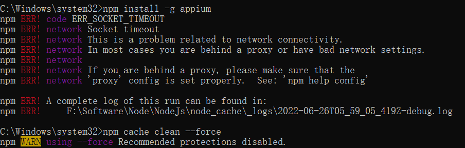
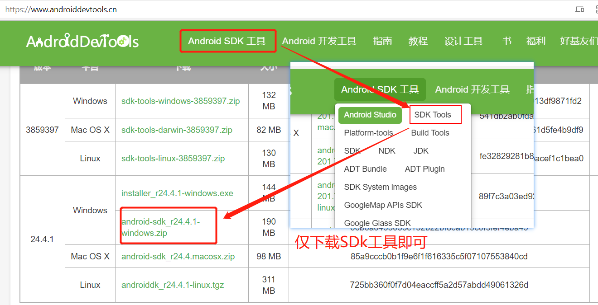
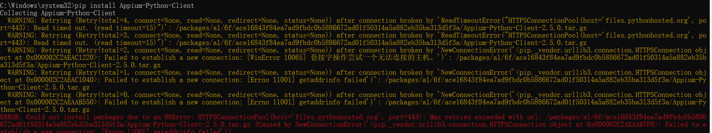
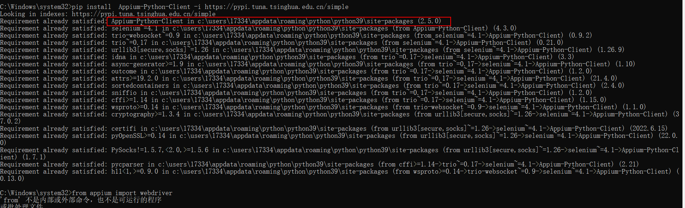
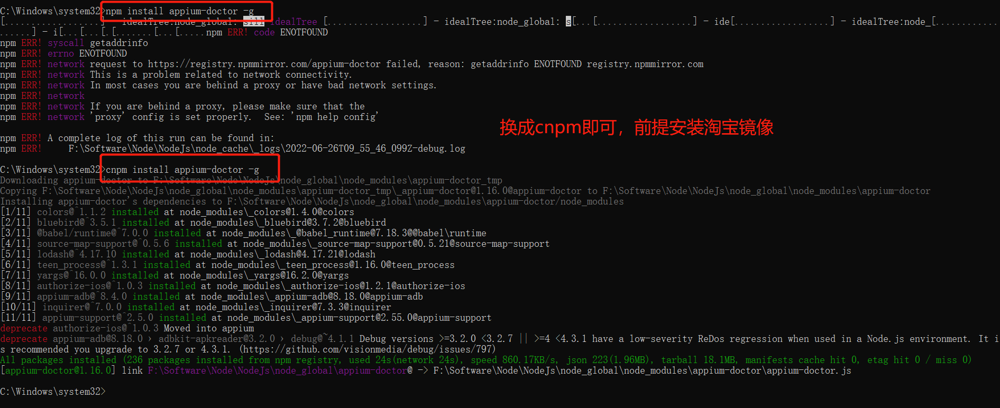

# 陈之微的学习指南
安装包资源链接：
>链接：https://pan.baidu.com/s/1AMqsxKy5GMN0hhsZap4LHw?pwd=TEST 
提取码：TEST

版本|更新内容|时间
|:----:| :-----| :----:  |
V1.0|1、常用Linux、Git、SQL、APP测试命令；|2022.6.21|
V1.2|1、增加常用环境搭建说明；|2022.6.22|
V1.3|1、增加写在最后积累文档|2022.6.23|
V1.4|1、增加Fiddler、协议相关内容|2022.6.23|
V1.5|1、增加Appium说明、AndroidSDK下载内容|2022.6.23|


---
<!-- TOC -->

- [陈之微的学习指南](#陈之微的学习指南)
- [一、常用Linux命令](#一常用linux命令)
  - [命令 cd](#命令-cd)
  - [命令 mv](#命令-mv)
  - [命令 cp](#命令-cp)
  - [命令 mkdir](#命令-mkdir)
  - [命令 history](#命令-history)
  - [命令 tail](#命令-tail)
  - [命令 tar](#命令-tar)
  - [命令 ls](#命令-ls)
  - [命令 ps](#命令-ps)
  - [命令 top](#命令-top)
  - [命令wget](#命令wget)
  - [命令 find](#命令-find)
  - [命令 继续find（进阶）](#命令-继续find进阶)
  - [命令 rm](#命令-rm)
  - [文件操作系列命令](#文件操作系列命令)
  - [查看文件系列命令](#查看文件系列命令)
  - [命令 yum&scp](#命令-yumscp)
  - [命令clear、df、du、ifconfig](#命令cleardfduifconfig)
  - [命令 vi + chmod](#命令-vi--chmod)
  - [持续更新的常用命令积累](#持续更新的常用命令积累)
    - [1、内容比较少的文件查看](#1内容比较少的文件查看)
    - [2、tail](#2tail)
    - [3、find](#3find)
    - [4、进入文件中，光标在行首、行尾切换：](#4进入文件中光标在行首行尾切换)
    - [5、文件中输入错误，撤销输入与恢复撤销命令：](#5文件中输入错误撤销输入与恢复撤销命令)
    - [6、删除光标前的字符](#6删除光标前的字符)
    - [7、分支所有修改的撤销](#7分支所有修改的撤销)
    - [8、打包后，报错`code ELIFECYCLE`，临时解决](#8打包后报错code-elifecycle临时解决)
    - [9、清除Redis缓存](#9清除redis缓存)
- [二、常用Git命令训练](#二常用git命令训练)
  - [1、安装GIT服务](#1安装git服务)
  - [2、注册Git账号](#2注册git账号)
  - [3、建立git仓库（附流程重点）](#3建立git仓库附流程重点)
  - [4、进入git仓库（重点）](#4进入git仓库重点)
    - [如何将代码仓库拉取到本地，并将本地文件上传到Github](#如何将代码仓库拉取到本地并将本地文件上传到github)
  - [GIt报错](#git报错)
- [三、APP测试命令](#三app测试命令)
  - [1、adb命令](#1adb命令)
  - [2、Monkey命令](#2monkey命令)
- [四、SQL基础](#四sql基础)
  - [1、SQL 语句后面的分号？](#1sql-语句后面的分号)
  - [2、SQL DML 和 DDL](#2sql-dml-和-ddl)
  - [- DROP INDEX - 删除索引](#--drop-index---删除索引)
  - [3、SQL SELECT 语句](#3sql-select-语句)
- [五、常用工具环境安装](#五常用工具环境安装)
  - [1、Node.js](#1nodejs)
  - [2、VsCode：IDE](#2vscodeide)
  - [3、Hexo](#3hexo)
  - [4、Yarn](#4yarn)
- [六、Jmeter](#六jmeter)
  - [1、JMeter36个内置函数及11个新增函数介绍](#1jmeter36个内置函数及11个新增函数介绍)
  - [2、jmeter 生成逐渐加一的数字（计数器）](#2jmeter-生成逐渐加一的数字计数器)
  - [3、性能测试知多少 --并发用户数与TPS之间的关系](#3性能测试知多少---并发用户数与tps之间的关系)
- [七、Fiddler](#七fiddler)
  - [1、PC客户端数据分析工具Fiddler+Proxifer(APP使用WiFi转发)](#1pc客户端数据分析工具fiddlerproxiferapp使用wifi转发)
  - [2、Fiddler 过滤指定域名](#2fiddler-过滤指定域名)
  - [3、Fiddler实现弱网测试](#3fiddler实现弱网测试)
  - [4、用fiddler实现android手机抓包](#4用fiddler实现android手机抓包)
- [八、Appium](#八appium)
  - [1、Appium安装与环境配置](#1appium安装与环境配置)
  - [python接口web自动化+测试开发](#python接口web自动化测试开发)
- [协议](#协议)
  - [QUIC协议原理详解（腾讯云CDN）](#quic协议原理详解腾讯云cdn)
- [其它技术](#其它技术)
  - [数据埋点](#数据埋点)
  - [WireShark](#wireshark)
  - [pytest](#pytest)
  - [Python 的Faker库](#python-的faker库)
  - [Windows下Git多账号配置，同一电脑多个ssh-key的管理](#windows下git多账号配置同一电脑多个ssh-key的管理)
- [资源站点](#资源站点)

<!-- /TOC -->

---

<br/>


# 一、常用Linux命令
  - [命令 cd](#命令-cd)
  - [命令 mv](#命令-mv)
  - [命令 cp](#命令-cp)
  - [命令 mkdir](#命令-mkdir)
  - [命令 history](#命令-history)
  - [命令 tail](#命令-tail)
  - [命令 tar](#命令-tar)
  - [命令 ls](#命令-ls)
  - [命令 ps](#命令-ps)
  - [>ps -ef](#ps--ef)
  - [命令 top](#命令-top)
  - [命令wget](#命令wget)
  - [命令 find](#命令-find)
  - [命令 继续find（进阶）](#命令-继续find进阶)
  - [命令 rm](#命令-rm)
  - [文件操作系列命令](#文件操作系列命令)
  - [查看文件系列命令](#查看文件系列命令)
  - [命令 yum&scp](#命令-yumscp)
  - [命令clear、df、du、ifconfig](#命令cleardfduifconfig)
  - [命令 vi + chmod](#命令-vi--chmod)
  - [持续更新的常用命令积累](#持续更新的常用命令积累)
    - [1、内容比较少的文件查看](#1内容比较少的文件查看)
    - [2、tail](#2tail)
    - [3、find](#3find)
    - [4、进入文件中，光标在行首、行尾切换：](#4进入文件中光标在行首行尾切换)
    - [5、文件中输入错误，撤销输入与恢复撤销命令：](#5文件中输入错误撤销输入与恢复撤销命令)
    - [6、删除光标前的字符](#6删除光标前的字符)
    - [7、分支所有修改的撤销](#7分支所有修改的撤销)
    - [8、打包后，报错`code ELIFECYCLE`，临时解决](#8打包后报错code-elifecycle临时解决)
    - [9、清除Redis缓存](#9清除redis缓存)


## 命令 cd
1.如何进入上级目录
>cd ..

2.如何进入当前用户主目录
>cd ~

3.如何进入上两级目录
>cd ../..

4.进入当前目录命令
>cd .

5.如何进入目录 /usr/isTester
>cd /usr/isTester

---


## 命令 mv
1.移动一个文件夹（isTester文件夹，移动到/APP/www目录）
>mv ~/isTester/ /APP/www

2.移动一个文件（isTester.ini  移动到/APP/www目录）
>mv isTester.ini  /APP/www

3.当前目录istester.tar.gz 移动到 /usr/ido 目录，并重命名为istester1228.tar.gz
>mv isTester.tar.gz /usr/ido/ido.tar.gz

4.移动文件到上级目录
>mv isTester.tar.gz ../

5.一条命令，移动两个文件 isTester.tar idoxu.tar 到目录 /APP/www
>mv isTester.tar idoxu.tar  -t /APP/www

---
## 命令 cp
1.复制当前目录部署包isTester.tar.gz 到备份目录/APP/www/bak 目录
>cp isTester.tar.gz /APP/www/bak

2.复制文件夹 isTester 到部署目录 /APP/www
>cp -r isTester/ /APP/www

---
## 命令 mkdir
在目录/APP/www 下，
>cd /APP/www 

1.新建一个文件夹 isTester
>mkdir isTester

2.新建三个文件夹 isTester1 isTester2 isTester3
>mkdir isTester1 isTester2 isTester3

3.新建一个多层级文件夹 idoxu/20181230/01
>mkdir -p idoxu/20181230/01

---
## 命令 history 
1.查看历史命令执行记录 
>history 

2.查看命令mkdir 的历史执行记录 
>history | grep mkdir 

3.执行历史记录中，序号为178的命令 
>!178

---
## 命令 tail
1.实时刷新log
>tail -f isTester.log

2.实时刷新最新500条log
>tail -500f isTester.log

---
## 命令 tar
1.压缩一个文件 isTester.ini 
>tar -cvf isTester.tar isTester.ini 

2.压缩多个文件 isTester.ini  readme.ini
>tar -cvf all.tar isTester.ini readme.ini

3.压缩文件夹  isTester/
>tar -cvf isTester.tar isTester/

4.将当前目录，所有jpg文件打包成isTesterjpg.tar
>tar -cvf isTesterjpg.tar *.jpg

5.将当前目录，所有jpg文件打包成isTesterjpg.tar.gz
>tar -zcvf isTesterjpg.tar.gz *.jpg

6.解压 isTesterjpg.tar
>tar -xvf isTesterjpg.tar

7.解压 isTesterjpg.tar.gz
>tar -zxvf isTesterjpg.tar.gz

---
## 命令 ls
1.列出当前目录中所有的子目录和文件。
>ls

2.列出目录下的所有文件（包含隐**件）
>ls -a

3.列出文件的详细信息（包括权限、所有者、文件大小等）
>ls -l

4.列出当前目录中所有以“isTester”开头的详细内容
>ls -l isTester*

---
## 命令 ps
1.查看所有进程
>ps -A

2.查看java进程
>ps -ef|grep java

3.显示所有进程信息，连同命令行
>ps -ef

---

## 命令 top
1.显示进程信息
>top

2.监控每个逻辑CPU的状况
>top  ，按 1

3.高亮显示当前运行进程
>top ，按 b

4.显示 完整命令
>top ，按 c

5.退出top程序
>按 q

---
## 命令wget
Linux系统中的wget是一个下载文件的工具，对于Linux用户是必不可少的工具
>文件地址：
>http://51.istester.com/isTester.png

1.下载isTester.jpg文件
>`wget http://51.istester.com/isTester.png`

2.下载isTester.jpg文件，并存储名为isTester_Logo.jpg
>`wget -o isTester_Logo.jpg http://51.istester.com/isTester.png`

3.下载isTester.jpg文件，后台形式下载
>`wget -b http://51.istester.com/isTester.png`

---
## 命令 find
1.在/root/isTester 目录及其子目录下面查找名字为isTester.ini的文件 
>find /root/isTester/ -name isTester.ini

2.在当前目录及其子目录中查找任何扩展名为“ini”的文件
>find .-name "*.ini"

3.在/root/isTester目录下查找更改时间在5日以内的文件 
>find /root/isTester/ -mtime +5

4.在/root/isTester目录下查找更改时间在3日以前的文件
>find /root/isTester/ -mtime -3

5.在/root/isTester目录下查找所有的目录
>find .-type d

6.在/root/isTester目录下查找所有的文件
>find /root/isTester/ -type f

---
## 命令 继续find（进阶）
1.在当前目录，所有的普通文件中搜索istester这个词
>find ./ -type f |xargs grep "istester"

2.在当前目录，删除1天以内的所有东西 
>find ./ -mtime -1 -print | xargs rm -rf

3.在当前目录，删除10天以前的所有东西（实操的时候，需谨慎，确保在自己建的目录内，别把系统目录删了…）
>find ./ -mtime +10 -print | xargs rm -rf

4.删除文件大小为零的文件
>find ./ -size 0 | xargs rm -rf

---
## 命令 rm
rm是常用的命令，该命令的功能为删除目录/文件（可同时删除，多个文件 / 多个目录）
当然，这也是一个非常危险的命令，建议少用（比如经常出现的误操作 rm * -rf 此命令慎用）\
1.删除/root/isTester/目录下的文件isTester.ini （系统会询问是否删除）
>rm /root/isTester/isTester.ini

2.强行删除/root/isTester/目录下的文件isTester.ini（直接删除，系统不会提示）
>rm -f /root/isTester/isTester.ini

3.删除/root/isTester/目录下的所有.log文件
>rm -f /root/isTester/*.log

4.删除/root/isTester/目录下的 ido/文件夹
>rm -r /root/isTester/ido/

5.强行删除/root/isTester/目录下的 ido/文件夹
>rm -rf /root/isTester/ido/

6.删除/root/isTester/目录下的所有内容
>rm -rf /root/isTester/*

---
## 文件操作系列命令
1.创建文件，你知道有哪几个命令 ？（写出至少两种方式）  
```
1) touch isTester.ini  
2) vi isTester.md
3) echo ‘only test’  > isTester.com
4) cp isTester.ini isTester666.ini
5) ls > fileList.txt
```
2.同时创建文件 isTester6.ini idoxu.ini
>touch isTester6.ini idoxu.ini

3.同时创建2000个文件  isTester0001.ini  - isTester2000.ini
>touch istester{0001..2000}.ini

4.更改文件 isTester.ini时间为当前时间
>touch isTester.ini

---
## 查看文件系列命令  
命令提示
>#cat  由第一行开始显示档案内容\
>#tac  从最后一行开始显示，可以看出 tac 是 cat 的倒着写！ \
>#more 一页一页的显示档案内容 \
>#less 与 more 类似，但是比 more 更好的是，他可以往前翻页！ \
>#head 只看头几行 \
>#tail 只看尾巴几行 \
>#nl   显示的时候，顺道输出 行号！ \

1.查看文件 isTester.ini的内容
>cat isTester.ini

2.看文件 isTester.ini前20行内容
>head -n 20 isTester.ini

3.看文件 isTester.ini最后30行内容
>tail -n 30 isTester.ini

4.显示文件isTester.ini 的第10至20行的内容
>head -n 20 isTester.ini | tail -n 10

5.倒序显示文件isTester.ini 前10行的内容
>tac isTester.ini | head -n 10

6.显示文件isTester.ini 前10行的内容，并显示行号
>nl isTester.ini | head -n 10

---
## 命令 yum&scp
假设 当前服务器`ip  192.168.1.23`\
1.从Linux服务器192.168.1.22 拷贝文件isTester.ini 到服务器192.168.1.23
>scp root@192.168.1.22:/root/idoxu/isTester.ini /root/idoxu 

2.从Linux服务器192.168.1.22 拷贝目录 isTester/ 到服务器192.168.1.23
>scp -r root@192.168.1.22:/root/idoxu/isTester/ /root/idoxu

3.Linux下安装scp命令（假设是centos服务器，命令用yum）
>yum install openssh-clients 

---
## 命令clear、df、du、ifconfig
1.查看当前服务器ip
>ifconfig

2.查看当前服务器硬盘空间
>df -h

3.查看目录isTester/ 所占有的空间
>du -sh isTester

4.清空当前终端屏幕
>clear

---
## 命令 vi + chmod 
>vi 创建文件 + 编辑文件。\
>chmod命令用于改变linux系统文件或目录的访问权限。\

1.创建文件 isTester.ini
>vi isTester.ini

2.更新文件内容为“21 day Linux Learn ,I'm Idolaoxu,in shenzhen .”
>输入 i ，进入编辑模式，输入内容，esc进入命令模式 :wq 保存 。

3.将文件 isTester.ini 设为所有人皆可读取
>chmod +r isTester.ini

4.将 isTester.ini 设定为只有该文件拥有者可以执行
>chmod u+x isTester.ini

5.给文件 isTester.ini 设置所有权限
>chmod 777 isTester.ini (或者 chmod a=rwx isTester.ini)\
>注：chmod还有很多命令用法，如上几种，满足日常需求 。

---
## 持续更新的常用命令积累
### 1、内容比较少的文件查看
>`cat -n 文件名`
文件名为非英文、下划线命名，带有其它符号时，要用双引号，如：\
`cat -n "manager->api->examreview->aiOverviewSummary.php"`\
`-n`：为显示文件的行数，这里一个空行就算一行；

另外此命令与grep命令组合使用，如 ：
>`cat -n | grep 字符名`\

字符带有空格时，需要使用单引号，如：
>`cat -n | grep  '字符1 字符2'`

---
### 2、tail
1)查看日志 
>`tail -f 文件名`\
`-f`：持续显示文件最新追加的内容

文件名、grep关联与cat命令一致
>`-c`：输出文件尾部的N（N为整数）个字节内容，如：\
`tail -c20 文件名`：
输出文件最后的20个字节\
注：退出需要按Ctrl+C，注意Shell软件的按键冲突；

---
### 3、find
查询服务器路径下，某个文件名，如：
>find 服务器目录 -name '*文件名.docx'

---
### 4、进入文件中，光标在行首、行尾切换：
>ctrl+a移到行首；、
ctrl+e移到行尾。

---
### 5、文件中输入错误，撤销输入与恢复撤销命令：
>撤销：u、
恢复撤销：ctrl+r 都需要在命令模式下敲。

---
### 6、删除光标前的字符
>Ctrl+W

---
### 7、分支所有修改的撤销
>[root@centos 目录]# `git checkout .`\
注：“.”代表所有修改，加文件名可以指定撤销某个文件；

---
### 8、打包后，报错`code ELIFECYCLE`，临时解决
>参考博文:https://blog.csdn.net/qq_43203949/article/details/110227650
```
rm -rf node_modules
rm package-lock.json
npm cache clear --force
npm install
```

---
### 9、清除Redis缓存
命令：redis-cli -p 服务器端口号\
输入密码： auth Redis配置文件的密码\
命令：flusall
>[root@centos 目录]# `redis-cli -p 端口号`\
127.0.0.1:端口号> `auth 密码`\
127.0.0.1:端口号> `flushall`\
注：退出输入`exit`命令\

<br/>

# 二、常用Git命令训练
  - [1、安装GIT服务](#1安装git服务)
  - [2、注册Git账号](#2注册git账号)
  - [3、建立git仓库（附流程重点）](#3建立git仓库附流程重点)
  - [4、进入git仓库（重点）](#4进入git仓库重点)
    - [如何将代码仓库拉取到本地，并将本地文件上传到Github](#如何将代码仓库拉取到本地并将本地文件上传到github)

## 1、安装GIT服务
1）在你自己的Linux服务器（Mac也可以），安装git服务
>参考文章http://istester.com/git/118.html\
博文：https://blog.csdn.net/m0_46278037/article/details/118789168

当然，windows用git命令行，也是可以玩的 。
如果还没有Linux服务器，参考文章（虚拟机 / 或 云服务器）  
http://istester.com/linux/384.html
补充，如果已经安装了的，可以试试初始化一个git仓库。

## 2、注册Git账号
去git远程仓库，注册一个你自己的账号（用来后续的拉代码、提交代码、更新代码）；
注册地址：http://git.istester.com/
>注：如上，自己注册账号即可，后续git仓库项目，需要用到账号的，用此账号即可；\
补充，已经有账号的，可以自己先试试，把：http://t.istester.com:3000/21DayisTester/LinuxBlog.git 代码拉到你电脑本地。

## 3、建立git仓库（附流程重点）
1）建立你自己的专属「远程Git代码仓库」
创建账号后如何创建自己的库：\
知乎链接：https://zhuanlan.zhihu.com/p/91652100\
（1）选择创建一个新仓库\
（2）填写创建仓库相关信息

>注意：
>- 仓库名尽量使用数字+英文字母，少用其它符号；如果想要自己的仓库可被实时访问，命名必须使用：<我的名字>.github.io，如ArtOfTseting.github.io
>- `[Add .gitignore]`：后期配置的文件，帮助我们在git add时将我们指定的一些文件自动排除在外，不提交到git当中。\
博文链接：https://zhuanlan.zhihu.com/p/264995020
>- `[Choose a license]`：即开源许可证即授权条款。开源软件并非完全没有限制。最基本的限制，就是开源软件强迫任何使用和修改该软件的人承认发起人的著作权和所有参与人的贡献。\
博文链接：https://blog.csdn.net/qq_35246620/article/details/77647234


（3）如何将本机电脑，链接到GIT仓库
- 进入当前登录的电脑用户C盘`[C:\Users\当前登录用户\.ssh]`，选择`[.ssh]`的文件夹：（这里我出现了没有SSH文件夹的情况，但是随便找的一个文件夹生成秘钥后，也没什么问题）
- 右键单机空白处，选中`[Git Bash here]`功能；输入以下命令，创建公钥和私钥：
>$ `ssh-keygen -t ed25519 -C "Git账号登录的邮箱"`

其中，`[ed25519]`是GitHub的加密算法，常用有`rsa`(长度较长)等\
`[Enter file in which to save the key]`是指定生成的文件名，可以不选直接回车；\
[Enter passphrase]是输入SSH链接的密码，后期可能比较麻烦，会频繁需要这个密码才能登陆；\
- 回车完后，会生成两个文件`[id_ed25519]`、`[id_ed25519.pub]`，带`pub`的是公钥文件，需要到`GitHub`上配置：

---
<br/>

## 4、进入git仓库（重点）
1）进入「你自己的远程仓库」；\
2）查看你的仓库地址\
>参考文章http://istester.com/git/442.html\
博文链接：
使用git拉取远程仓库代码：\
https://blog.csdn.net/qq_35408421/article/details/119213912\
https://blog.csdn.net/ly_xiamu/article/details/110848431

---
### 如何将代码仓库拉取到本地，并将本地文件上传到Github
  
**1、设置提交时的用户名**
>git config --global user.name '想设置的用户名'\
git config --global user.email '想设置的邮箱'

查看当前系统用户：
>git config -l | grep user

在某文件夹的仓库下提交，可以使用：
>$ git config --local user.name 'newname'

**2、使用SSH协议链接，并使用git clone拉取远程仓库；**
>git clone [仓库SSH的链接或者HTTP的链接]，如\
`$ git clone https://github.com/tianqixin/runoob-git-test`

**3、常用命令：**

>`Git status`：查看缓冲区文件\
`Git add .`：将所有文件添加到提交文件\
`Git commit`：提交文件到远程仓库，如：\
`git commit -m "提交说明"`\
`Git push origin 分支名`：将提交的代码提交到某分支；\
`git push -u origin main`：将代码推送到远程仓库\
`Git checkout 分支名`：切换分支\
`Git checkout .`：撤销所有修改，将[.]换成文件名为撤销指定文件；\
`Git branch`：查看当前所在分支，[-a]查看当前仓库所有分支

注：\
(1)仅克隆时无需指定username、password\
(2)仅以此文件夹为提交文件夹，需要将[global]改成local\
(3)链接自己的仓库，使用SSH方式，可以直接读取C盘下的私钥，不用输入用户名、密码；HTTPS方式适用于拉取他人的仓库；\
(4)删除仓库：仓库页面的Setting中，下滑到最后有Delete选项；\
(5)Git clone SSH链接：在任意文件夹中使用即可；


**4、新建本地文件夹，链接远程仓库**\
参考博文：\
https://cloud.tencent.com/developer/article/1504684\
https://blog.csdn.net/generallizhong/article/details/94014779\
1）新建文件夹，Git bash here，使用git init命令，使其成为一个git仓库(此处注意git和github没有半毛钱关系，github是远程仓库)\
2）运行命令：
```
git status
Git add .
Git  commit -m "first commit"
```
3）链接Github，此处使用SSH生成密匙，在Github创建仓库，上传公钥\
>链接远程仓库
$ git remote add origin SSH的链接

注：移除远程仓库：
>git remote
提交到远程仓库\
>$ git push -u origin master


**5、新建本地分支并拉取代码**\
1）新建本地分支（分支名，用你自己的昵称；如老徐 用 idoxu）参考命令：
>git branch idoxu

2）建立你本地电脑的代码仓库目录 
>mkdir -p ~/istester_git

3）把上面第2步获取的仓库代码拉到你本地 ；
>参考文章http://istester.com/git/445.html

**6、查看本地分支**\
查看本地分支
>`git branch`

**7、切换分支**\
1）切换到你新建的本地分支
>`git checkout idoxu`\
快捷可食用：`git co 分支名`

2）查看当前所在的分支\
>`git branch`

效果：
```
[root@istester gittest]# git checkout idoxu
Switched to branch 'idoxu'
[root@istester gittest]# git branch
* idoxu
  master
```
**8、本地分支push到远程服务器**\
把新建的本地分支push到远程服务器，远程分支与本地分支同名\
1）命令 
>`git push origin idoxu:idoxu`

2）效果
```
[root@istester gittest]# git push origin idoxu:idoxu
Total 0 (delta 0), reused 0 (delta 0)
To http://t.istester.com:3000/istester/gittest.git
 * [new branch]      idoxu -> idoxu
```
**9、查看远程仓库分支**
查看远程仓库有哪些分支\
1）命令 
>git branch -a

2）效果
```
[root@istester gittest]# git branch -a
  idoxu
* idoxu_dev
  idoxudev
  master
  remotes/origin/HEAD -> origin/master
  remotes/origin/idoxu
  remotes/origin/master
```
**10、创建并切换到某分支**\
创建你昵称的dev分支，并切换到那个分支\，比如：
>git checkout -b idoxu_dev

**11、删除本地分支**\
删除之前你自己创建的，自己昵称的dev分支（如老徐 idoxu_dev）\
1）命令 
>git branch -d 

2）效果\
如果提示无法删除；
```
[root@istester gittest]# git branch -d idoxu_dev 
error: Cannot delete branch 'idoxu_dev' checked out at '/root/gittest'
```
先切换到其他分支
```
[root@istester gittest]# git checkout idoxu
Switched to branch 'idoxu'
```
再删除
```
[root@istester gittest]# git branch -d idoxu_dev 
Deleted branch idoxu_dev (was 293eda3).
```
- 注：-d 与 -D 的比较，另删除远程分支是其它命令\
`git branch -d <branchName>`：删除一个名字为branchName的分支。如果该分支有提交未进行合并，则会删除失败。\
`git branch -D <branchName>`：强制删除一个名字为branchName 的分支。如果该分支有提交未进行合并，也会删除成功。

git删除远程分支
>git push origin --delete [branch_name]


**12、切换到某分支，修改某文件**\
1）切换到 你自己的昵称的本地分支；如老徐 的 idoxu
>git branch idoxu

2）修改文件 start_ByIdo.sh ，底部追加你的分支名注释 
>echo '#idoxu' >> start_ByIdo.sh

**13、查看仓库文件改动状态**\
1）命令 
>git status

2）效果
```
[root@istester gittest]# git status
On branch idoxu
Changes not staged for commit:
  (use "git add <file>..." to update what will be committed)
  (use "git checkout -- <file>..." to discard changes in working directory)
        modified:   start_ByIdo.sh
no changes added to commit (use "git add" and/or "git commit -a")
```
**14、查看文件 start_ByIdo.sh 具体改动了啥内容**
1）命令 
>git diff start_ByIdo.sh

2）效果
```
[root@istester gittest]# git diff start_ByIdo.sh
diff --git a/start_ByIdo.sh b/start_ByIdo.sh
index 792a827..09f73c6 100644
--- a/start_ByIdo.sh
+++ b/start_ByIdo.sh
@@ -1 +1,2 @@
 nohup ./gogs web >>/dev/null 2>&1 &
+#idoxu
```
**15、添加修改的文件并提交修改**\
1）添加修改的文件
>git add .：提交修改\
git commit -m "idoxu add"

**16、提交本次代码到远程idoxu分支（你自己的分支）**
>git push origin idoxu:idoxu

**17、去远程仓库，查看提交记录**\
参考文章http://istester.com/git/450.html

**18、从零开始，新建远程仓库，提交自己的本地代码到远程仓库**\
仓库文章http://istester.com/git/458.html

**19、仓库流程练习**\
1）新建一个自己的远程仓库；\
2）把自己本地的代码，提交到远程仓库；\
3）切换一个新的功能分支 istester/21day ；\
4）开发代码，提交到分支；\
>参考文章http://istester.com/git/459.html

- 合并分支
>参考文章http://istester.com/git/466.html

**20、解决合并冲突，自己如何模拟？**\
1）在前几天作业的基础上，再新建一个分支 istester/git21day
>git checkout -b istester/git21day

2）修改idoxu.ini文件
>vim idoxu.ini

3）随便修改点内容\
4）切到master分支\
5）合并istester/git21day 到master分支  ，参考昨天的文章：http://istester.com/git/466.html\
6）切换到昨天作业的分支 istester/21day\
7）重复如上 2、3、4 步骤\
8）合并istester/21day 到master分支  ，参考昨天的文章：http://istester.com/git/466.html\
9）查看是否有冲突？如有修改解决，如没有，看看哪里操作的问题；


## GIt报错
1、克隆时报错
```
fatal: unable to access 'https://github.com/xxx/autowrite.git/': 
OpenSSL SSL_read: Connection was reset, errno 10054
```
或者
```
fatal: unable to access 'https://github.com/xxx/autowrite.git/':
Failed to connect to github.com port 443: Timed out
```
因为git在拉取或者提交项目时，中间会有git的http和https代理，但是我们本地环境本身就有SSL协议了，所以取消git的https代理即可，不行再取消http的代理。

解决办法：
在项目文件夹的命令行窗口执行下面代码，然后再git commit 或git clone
取消git本身的https代理，使用自己本机的代理，如果没有的话，其实默认还是用git的
```
//取消http代理
git config --global --unset http.proxy
//取消https代理 
git config --global --unset https.proxy
```


<br/>

# 三、APP测试命令
## 1、adb命令
```
adb 使用的端口号，5037
adb devices：获取设备列表及设备状态
adb get-state：获取设备的状态
adb install：用于安装
adb uninstall：用于卸载
adb push：命令将PC机上的文件推到 DLT-RK3288 机器上
adb pull：命令将DLT-RK3288机器上的文件拉到PC机上
ls, cd, rm, mkdir, touch, pwd, cp, mv, ifconfig, netstat, ping, ps, top等，进入adb shell即可执行，与linux相似
```

打印默认日志数据
>adb logcat

需要打印日志详细时间的简单数据
>adb logcat -v time

需要打印级别为Error的信息
>adb logcat *:E

```
adb help：列出所有的选项说明及子命令
adb devices：获取设备列表及设备状态
adb get-state：获取设备的状态，设备的状态有 3 钟，device , offline , unknown，其中device：设备正常连接，offline：连接出现异常，设备无响应，unknown：没有连接设备

adb kill-server , adb start-server：结束 adb 服务， 启动 adb 服务，通常两个命令一起用，设备状态异常时使用 kill-server，然后运行 start-server 进行重启服务

adb logcat , 打印 Android 的系统日志   
adb logcat -c,清除日志
adb bugreport , 打印dumpsys、dumpstate、logcat的输出，也是用于分析错误，输出比较多，建议重定向到一个文件中，如adb bugreport > d:\bugreport.log

adb install ：安装应用，adb install -r 重新安装
adb uninstall ：卸载应用，后面跟的参数是应用的包名，请区别于 apk 文件名
adb pull ：将 Android 设备上的文件或者文件夹复制到本地，
例如复制 Sdcard 下的 pull.txt 文件到 D 盘：adb pull sdcard/pull.txt d:\，
重命名：adb pull sdcard/pull.txt d:\rename.txt

adb push： 推送本地文件至 Android 设备，
如推送 D 盘下的 push.txt 至 Sdcard：adb push d:\push.txt sdcard/   
sdcard 后面的斜杠不能少

adb reboot： 重启 Android 设备，    
adb reboot recovery：重启到Recovery界面    
adb reboot bootloader：重启到bootloader界面
adb root , adb remount：可以直接已这两个命令获取 root 权限，并挂载系统文件系统为可读写状态
adb get-serialno：返回设备序列号SN值    
adb get-product：获取设备的ID
adb forward tcp:5555 tcp:8000：做为主机向模拟器或设备的请求端口
adb shell：进入设备shell
adb shell pm list package:列出所有的应用的包名
adb shell screencap -p /sdcard/screen.png:截屏，保存至 sdcard 目录
adb shell screenrecord sdcard/record.mp4:执行命令后操作手机，ctrl + c 结束录制，录制结果保存至 sdcard

adb shell wm size：获取设备分辨率
adb shell pm dump 包名：列出指定应用的 dump 信息
adb shell pm path 包名：列出对应包名的 .apk 位置

adb shell monkey –p 程序包 –v 测试次数
比如“adb shell monkey –p com.htc.Weather –v 20000”意思是对com.htc.Weather 这个程序包单独进行一次20000次的monkey测试，其中程序包名称可以在串口终端这句命令获得：ls data/data 显示所有程序包

adb shell ps | grep [process]：找出对应的进程pid  
adb shell dumpsys meminfo [pid]，根据进程pid查看进程占用的内存    
或者adb shell dumpsys meminfo<package_name>：package_name 也可以换成程序的pid，pid可以通过 
adb shell top | grep app_name 来查找

adb shell ps：查看当前终端中的进程信息
ls：查看目录   
date：打印或设置当前系统时间   
cat /proc/meminfo：查看内存信息   
cat /proc/cpuinfo：查看CPU信息
```
抓取App报错的log日志：\
按住win+r打开cmd，cd到安装adb的目录下，然后输入指令：
>adb logcat -v time > D:\\logcat.log（可以换成其他磁盘）

输入完成之后敲击回车，这个时候在D盘下会生成一个logcat日志并且将近期的崩溃记录到这个日志当中。Ctrl+C以结束截取操作。
```
1.adb logcat *:V           不过滤地输出所有调试信息，显示所有日志信息
1.adb logcat *:D            Debug来表达调试信息，能输出Debug、Info、Warning、Error级别的Log信息。
1.adb logcat *:I              Info来表达一些信息，能输出Info、Warning、Error级别的Log信息。
1.adb logcat *:W            Warning表示警告，查找崩溃问题一般用：能输出Warning、Error级别的Log信息
2.adb logcat *:E             Error表示出现错误，能输出Error级别的Log信息。
```
## 2、Monkey命令
查看设备的链接情况：
>adb devices

手机里面的软件随机点击：
>adb shell monkey 1000

查看包名（-s只查找系统包名，-3只查看第三方包，-f输出包和包相关联的文件，-e只输出启用的包，-i只输出包和安装信息，-u只输出包和未安装包信息，都不加显示所有，）：
>adb shell pm list packages -s

启动一个指定包名
>adb shell monkey -p com.dyhoa.school 1000

操作日志
>adb shell monkey -p com.tencent.mobileqq -v -v 100

`1 参数`： -p 用于约束限制，用此参数指定一个或多个包（Package，即App）。指定包之后，monkey将只允许系统启动指定的APP,如果不指定包，将允许系统启动设备中的所有APP.
* 指定一个包： adb shell monkey -p cn.emoney.acg 10
* 指定多个包：adb shell monkey -p cn.emoney.acg –p cn.emoney.wea -p cn.emoney.acg 100
* 不指定包：adb shell monkey 100

`2 参数`: -v用于指定反馈信息级别（信息级别就是日志的详细程度），总共分3个级别，分别对应的参数如下表所示：
日志级别 0\
示例 adb shell monkey -p cn.emoney.acg –v 100\
说明缺省值，仅提供启动提示、测试完成和最终结果等少量信息\
日志级别1\
示例 adb shell monkey -p cn.emoney.acg –v -v 100\
说明提供较为详细的日志，包括每个发送到Activity的事件信息\
日志级别 2\
示例 adb shell monkey -p cn.emoney.acg –v -v –v 100\
说明最详细的日志，包括了测试中选中/未选中的Activity信息\

`3 参数`： -s
用于指定伪随机数生成器的seed值，如果seed相同，则两次Monkey测试所产生的事件序列也相同的。
>Monkey 测试1：adb shell monkey -p cn.emoney.acg -s 10  100\
Monkey 测试2：adb shell monkey -p cn.emoney.acg –s 10 100

两次测试的效果是相同的，因为模拟的用户操作序列（每次操作按照一定的先后顺序所组成的一系列操作，即一个序列）是一样的。\

`4 参数`： --throttle<毫秒>用于指定用户操作（即事件）间的时延，单位是毫秒；\
adb shell monkey -p cn.emoney.acg --throttle 5000 100\

`5 参数`：
用于指定当应用程序崩溃时（Force& Close错误），Monkey是否停止运行。如果使用此参数，即使应用程序崩溃，Monkey依然会发送事件，直到事件计数完成。
 >--ignore-crashes

测试过程中即使程序崩溃，Monkey依然会继续发送事件直到事件数目达到1000为止
>adb shell monkey -p cn.emoney.acg --ignore-crashes 1000

测试过程中，如果acg程序崩溃，Monkey将会停止运行
>adb shell monkey -p cn.emoney.acg 1000


`6 参数`：
用于指定当应用程序发生ANR（Application No Responding）错误时，Monkey是否停止运行。如果使用此参数，即使应用程序发生ANR错误，Monkey依然会发送事件，直到事件计数完成。
>--ignore-timeouts，示例：\
adb shellmonkey -p cn.emoney.acg --ignore-timeouts 1000

`7 参数`：用于指定当应用程序发生许可错误时（如证书许可，网络许可等），Monkey是否停止运行。如果使用此参数，即使应用程序发生许可错误，Monkey依然会发送事件，直到事件计数完成。
>--ignore-security-exceptions\
adb shellmonkey -p cn.emoney.acg --ignore-security-exception 1000

`8 参数`：用于指定当应用程序发生错误时，是否停止其运行。如果指定此参数，当应用程序发生错误时，应用程序停止运行并保持在当前状态。应用程序仅是静止在发生错误时的状态，系统并不会结束该应用程序的进程
>--kill-process-after-error\
adb shellmonkey -p cn.emoney.acg --kill-process-after-error 1000

`9 参数`：用于指定是否监视并报告应用程序发生崩溃的本地代码。
>--monitor-native-crashes\
adb shellmonkey -p cn.emoney.acg --monitor-native-crashes 1000

`10 参数`：用于指定每种类别事件的数目百分比（在Monkey事件序列中，该类事件数目占总事件数目的百分比）
>--pct-｛+事件类别｝｛+事件类别百分比｝

示例:
```
--pct-touch｛+百分比｝
调整触摸事件的百分比(触摸事件是一个down-up事件，它发生在屏幕上的某单一位置)
adb shell monkey -p cn.emoney.acg --pct-touch 10 1000

--pct-motion ｛+百分比｝
调整动作事件的百分比(动作事件由屏幕上某处的一个down事件、一系列的伪随件机事和一个up事件组成)
adb shell monkey -p cn.emoney.acg --pct-motion 20 1000

--pct-trackball ｛+百分比｝
调整轨迹事件的百分比(轨迹事件由一个或几个随机的移动组成，有时还伴随有点击)
adb shell monkey -p cn.emoney.acg --pct-trackball 30 1000

--pct-nav ｛+百分比｝
调整“基本”导航事件的百分比(导航事件由来自方向输入设备的up/down/left/right组成)
adb shell monkey -p cn.emoney.acg --pct-nav 40 1000

--pct-majornav ｛+百分比｝
调整“主要”导航事件的百分比(这些导航事件通常引发图形界面中的动作，如：5-way键盘的中间按键、回退按键、菜单按键)
adb shell monkey -p cn.emoney.acg --pct-majornav 50 1000
```

**注：输出monkeylog**\
跑monkey的时候或者想抓程序log导出时，有时会提示：\
`cannot create D:monkeytest.txt: read-only file system`\
为什么有时候可以有时候不可以？\
后来发现跟使用使用习惯不一样，一会是先进入adb shell 再用命令，一会是直接命令进入。
进入adb shell后再用命令就会失败~\
正确方法：退出shell或者执行命令时先不要进shell
>C:\Documents and Settings\Administrator>adb shell monkey -p 包名 -v 300  >e:\text.txt

进入adb shell后就相当于进入linux的root下面，没有权限在里面创建文件~

<br/>

# 四、SQL基础
重要事项\
一定要记住，SQL 对大小写不敏感！

## 1、SQL 语句后面的分号？
某些数据库系统要求在每条 SQL 命令的末端使用分号。在我们的教程中不使用分号。

分号是在数据库系统中分隔每条 SQL 语句的标准方法，这样就可以在对服务器的相同请求中执行一条以上的语句。

如果您使用的是 MS Access 和 SQL Server 2000，则不必在每条 SQL 语句之后使用分号，不过某些数据库软件要求必须使用分号。

---

## 2、SQL DML 和 DDL
可以把 SQL 分为两个部分：数据操作语言 (DML) 和 数据定义语言 (DDL)。
SQL (结构化查询语言)是用于执行查询的语法。但是 SQL 语言也包含用于更新、插入和删除记录的语法。

查询和更新指令构成了 SQL 的 DML 部分：
- SELECT - 从数据库表中获取数据
- UPDATE - 更新数据库表中的数据
- DELETE - 从数据库表中删除数据
- INSERT INTO - 向数据库表中插入数据

SQL 的数据定义语言 (DDL) 部分使我们有能力创建或删除表格。我们也可以定义索引（键），规定表之间的链接，以及施加表间的约束。

SQL 中最重要的 DDL 语句:
- CREATE DATABASE - 创建新数据库
- ALTER DATABASE - 修改数据库
- CREATE TABLE - 创建新表
- ALTER TABLE - 变更（改变）数据库表
- DROP TABLE - 删除表
- CREATE INDEX - 创建索引（搜索键）
- DROP INDEX - 删除索引
---

## 3、SQL SELECT 语句
SELECT 语句用于从表中选取数据。
结果被存储在一个结果表中（称为结果集）。\
1)SQL SELECT 语法：
```SQL
SELECT 列名称 FROM 表名称
```
以及：
```SQL
SELECT * FROM 表名称
#注释：SQL 语句对大小写不敏感。SELECT 等效于 select。
```
(1)SQL SELECT 实例\
如需获取名为 "LastName" 和 "FirstName" 的列的内容（从名为 "Persons" 的数据库表），请使用类似这样的 SELECT 语句：
```SQL
SELECT LastName,FirstName FROM Persons
```
"Persons" 表:
Id|LastName|FirstName|Address	City
1	Adams	John	Oxford Street	London
2	Bush	George	Fifth Avenue	New York
3	Carter	Thomas	Changan Street	Beijing

结果：
LastName	FirstName
Adams	John
Bush	George
Carter	Thomas

(2)SQL SELECT * 实例\
现在我们希望从 "Persons" 表中选取所有的列。\
请使用符号 * 取代列的名称，就像这样：
```SQL
SELECT * FROM Persons
```
提示：星号（*）是选取所有列的快捷方式。

(3)SQL SELECT DISTINCT 语句\
在表中，可能会包含重复值。这并不成问题，不过，有时您也许希望仅仅列出不同（distinct）的值。\
关键词 DISTINCT 用于返回唯一不同的值。\
语法：
```SQL
SELECT DISTINCT 列名称 FROM 表名称
```
(4)WHERE 子句\
如需有条件地从表中选取数据，可将 WHERE 子句添加到 SELECT 语句。\
语法：
```SQL
SELECT 列名称 FROM 表名称 WHERE 列 运算符 值
```
下面的运算符可在 WHERE 子句中使用：
```
操作符	描述
=	等于
<>	不等于
>	大于
<	小于
>=	大于等于
<=	小于等于
BETWEEN	在某个范围内
LIKE	搜索某种模式
注释：在某些版本的 SQL 中，操作符 <> 可以写为 !=。
```
(5)AND 和 OR 运算符\
AND 和 OR 可在 WHERE 子语句中把两个或多个条件结合起来。\
如果第一个条件和第二个条件都成立，则 AND 运算符显示一条记录。\
如果第一个条件和第二个条件中只要有一个成立，则 OR 运算符显示一条记录。\

(6)AND 运算符实例\
使用 AND 来显示所有姓为 "Carter" 并且名为 "Thomas" 的人：
```SQL
SELECT * FROM Persons WHERE FirstName='Thomas' AND LastName='Carter'
```
(7)OR 运算符实例\
使用 OR 来显示所有姓为 "Carter" 或者名为 "Thomas" 的人：
```SQL
SELECT * FROM Persons WHERE firstname='Thomas' OR lastname='Carter'
```

(8)结合 AND 和 OR 运算符\
我们也可以把 AND 和 OR 结合起来（使用圆括号来组成复杂的表达式）:
```SQL
SELECT * FROM Persons WHERE (FirstName='Thomas' OR FirstName='William')
AND LastName='Carter'
```

(9)ORDER BY 语句\
ORDER BY 语句用于根据指定的列对结果集进行排序。\
ORDER BY 语句默认按照升序对记录进行排序。\
如果您希望按照降序对记录进行排序，可以使用 DESC 关键字。
```SQL
SELECT Company, OrderNumber FROM Orders ORDER BY Company
```
以逆字母顺序显示公司名称，并以数字顺序显示顺序号：
```SQL
SELECT Company, OrderNumber FROM Orders ORDER BY Company DESC, OrderNumber ASC
```
结果：
Company	OrderNumber
W3School	2356
W3School	6953
IBM	3532
Apple	4698

(10)INSERT INTO 语句
INSERT INTO 语句用于向表格中插入新的行。
语法：
INSERT INTO 表名称 VALUES (值1, 值2,....)
我们也可以指定所要插入数据的列：
INSERT INTO table_name (列1, 列2,...) VALUES (值1, 值2,....)
INSERT INTO Persons (LastName, Address) VALUES ('Wilson', 'Champs-Elysees')

(11)Update 语句
Update 语句用于修改表中的数据。
语法：
UPDATE 表名称 SET 列名称 = 新值 WHERE 列名称 = 某值
更新某一行中的若干列
我们会修改地址（address），并添加城市名称（city）：
UPDATE Person SET Address = 'Zhongshan 23', City = 'Nanjing'
WHERE LastName = 'Wilson'
(12)SQL TOP 实例
现在，我们希望从上面的 "Persons" 表中选取头两条记录。
我们可以使用下面的 SELECT 语句：
SELECT TOP 2 * FROM Persons

(13)SQL TOP PERCENT 实例
现在，我们希望从上面的 "Persons" 表中选取 50% 的记录。
我们可以使用下面的 SELECT 语句：
SELECT TOP 50 PERCENT * FROM Persons

(14)LIKE 操作符
LIKE 操作符用于在 WHERE 子句中搜索列中的指定模式。

例子 1：
现在，我们希望从上面的 "Persons" 表中选取居住在以 "N" 开始的城市里的人：
我们可以使用下面的 SELECT 语句：
SELECT * FROM Persons
WHERE City LIKE 'N%'
注：%位置决定搜索结果，N%表示以N开始的数据，%N%表示包含，%N表示结尾。

NOT 关键字
通过使用 NOT 关键字，我们可以从 "Persons" 表中选取居住在不包含 "lon" 的城市里的人：
我们可以使用下面的 SELECT 语句：
SELECT * FROM Persons
WHERE City NOT LIKE '%lon%'

(15)SQL 通配符
在搜索数据库中的数据时，SQL 通配符可以替代一个或多个字符。
SQL 通配符必须与 LIKE 运算符一起使用。
在 SQL 中，可使用以下通配符：
通配符	描述
%	代表零个或多个字符
_	仅替代一个字符
[charlist]	字符列中的任何单一字符
[^charlist]或者[!charlist]	不在字符列中的任何单一字符

使用 _ 通配符
接下来，我们希望从 "Persons" 表中选取的这条记录的姓氏以 "C" 开头，然后是一个任意字符，然后是 "r"，然后是一个任意字符，然后是 "er"：
我们可以使用下面的 SELECT 语句：
SELECT * FROM Persons
WHERE LastName LIKE 'C_r_er'

使用 [charlist] 通配符
例子 1
现在，我们希望从上面的 "Persons" 表中选取居住的城市以 "A" 或 "L" 或 "N" 开头的人：
我们可以使用下面的 SELECT 语句：
SELECT * FROM Persons
WHERE City LIKE '[ALN]%'

(16)SQL IN 操作符
IN 操作符允许我们在 WHERE 子句中规定多个值。
SQL IN 语法：
SELECT column_name(s)
FROM table_name
WHERE column_name IN (value1,value2,...)

(17)SQL BETWEEN 操作符
操作符 BETWEEN ...AND 会选取介于两个值之间的数据范围。这些值可以是数值、文本或者日期。

BETWEEN 操作符实例
如需以字母顺序显示介于 "Adams"（包括）和 "Carter"（不包括）之间的人，请使用下面的 SQL：
SELECT * FROM Persons
WHERE LastName
BETWEEN 'Adams' AND 'Carter'
结果集：
Id	LastName	FirstName	Address	City
1	Adams	John	Oxford Street	London
2	Bush	George	Fifth Avenue	New York

重要事项：
不同的数据库对 BETWEEN...AND 操作符的处理方式是有差异的。某些数据库会列出介于 "Adams" 和 "Carter" 之间的人，但不包括 "Adams" 和 "Carter" ；某些数据库会列出介于 "Adams" 和 "Carter" 之间并包括 "Adams" 和 "Carter" 的人；而另一些数据库会列出介于 "Adams" 和 "Carter" 之间的人，包括 "Adams" ，但不包括 "Carter" 。
所以，请检查你的数据库是如何处理 BETWEEN....AND 操作符的！

实例 2
如需使用上面的例子显示范围之外的人，请使用 NOT 操作符：
SELECT * FROM Persons
WHERE LastName
NOT BETWEEN 'Adams' AND 'Carter'

(18)SQL Alias（别名）
SQL Alias
表的 SQL Alias 语法
SELECT column_name(s)
FROM table_name
AS alias_name

列的 SQL Alias 语法
SELECT column_name AS alias_name
FROM table_name

Alias 实例: 使用表名称别名
假设我们有两个表分别是："Persons" 和 "Product_Orders"。我们分别为它们指定别名 "p" 和 "po"。
现在，我们希望列出 "John Adams" 的所有定单。
我们可以使用下面的 SELECT 语句：
SELECT po.OrderID, p.LastName, p.FirstName
FROM Persons AS p, Product_Orders AS po
WHERE p.LastName='Adams' AND p.FirstName='John'

(19)SQL JOIN
用于根据两个或多个表中的列之间的关系，从这些表中查询数据。
引用两个表
我们可以通过引用两个表的方式，从两个表中获取数据：
SELECT Persons.LastName, Persons.FirstName, Orders.OrderNo
FROM Persons, Orders
WHERE Persons.Id_P = Orders.Id_P 

SQL JOIN - 使用 Join
除了上面的方法，我们也可以使用关键词 JOIN 来从两个表中获取数据。
如果我们希望列出所有人的定购，可以使用下面的 SELECT 语句：
SELECT Persons.LastName, Persons.FirstName, Orders.OrderNo
FROM Persons
INNER JOIN Orders
ON Persons.Id_P = Orders.Id_P
ORDER BY Persons.LastName

不同的 SQL JOIN
除了我们在上面的例子中使用的 INNER JOIN（内连接），我们还可以使用其他几种连接。
下面列出了您可以使用的 JOIN 类型，以及它们之间的差异。
JOIN: 如果表中有至少一个匹配，则返回行
LEFT JOIN: 即使右表中没有匹配，也从左表返回所有的行
RIGHT JOIN: 即使左表中没有匹配，也从右表返回所有的行
FULL JOIN: 只要其中一个表中存在匹配，就返回行

SQL LEFT JOIN 关键字
LEFT JOIN 关键字会从左表 (table_name1) 那里返回所有的行，即使在右表 (table_name2) 中没有匹配的行。

LEFT JOIN 关键字语法：
SELECT column_name(s)
FROM table_name1
LEFT JOIN table_name2 
ON table_name1.column_name=table_name2.column_name
注释：在某些数据库中， LEFT JOIN 称为 LEFT OUTER JOIN；
LEFT JOIN 关键字会从左表 (Persons) 那里返回所有的行，即使在右表 (Orders) 中没有匹配的行。

SELECT Persons.LastName, Persons.FirstName, Orders.OrderNo
FROM Persons
LEFT JOIN Orders
ON Persons.Id_P=Orders.Id_P
ORDER BY Persons.LastName

<br/>

# 五、常用工具环境安装
## 1、Node.js
>v16.4.0版下载地址：https://nodejs.org/download/release/v16.4.0/

安装博文：
>https://blog.csdn.net/chanyeolchichi/article/details/121348541\
https://blog.csdn.net/qq_40712862/article/details/120231621

## 2、VsCode：IDE
>安装地址：https://code.visualstudio.com/download\
安装博文：https://zhuanlan.zhihu.com/p/264785441

## 3、Hexo
>一键部署Github静态页面，前提安装Git、Node.js\
安装文档：https://hexo.io/zh-cn/docs/

## 4、Yarn
部署静态页面需要执行此命令
>安装文档：https://yarn.bootcss.com/docs/install/#windows-stable

Cmd安装命令：
```javascript
npm install --global yarn
```
Cmd安装检查：返回版本号
```javascript
yarn --version
```

<br/>

# 六、Jmeter
## 1、JMeter36个内置函数及11个新增函数介绍
>博文链接：https://blog.csdn.net/weixin_45741835

## 2、jmeter 生成逐渐加一的数字（计数器）
>博文链接：https://blog.csdn.net/weixin_44750991/article/details/109179461

## 3、性能测试知多少 --并发用户数与TPS之间的关系
>博文链接：https://blog.csdn.net/taric_ma/article/details/77285522

<br/>

# 七、Fiddler
## 1、PC客户端数据分析工具Fiddler+Proxifer(APP使用WiFi转发)
>博文链接：https://blog.csdn.net/sunbo_csdn/article/details/82292379

## 2、Fiddler 过滤指定域名
>博文链接：https://www.csdn.net/tags/NtTaggxsNzUwMTEtYmxvZwO0O0OO0O0O.html

## 3、Fiddler实现弱网测试
>博文链接：https://zhuanlan.zhihu.com/p/143080849

## 4、用fiddler实现android手机抓包
>博文链接：https://blog.csdn.net/michaelwoshi/article/details/114173158

<br/>

# 八、Appium
## 1、Appium安装与环境配置
>参考资料：https://zhuanlan.zhihu.com/p/113129781\
GUI下载地址：https://github.com/appium/appium-desktop/releases\
Python3 + Appium + 安卓模拟器 实现APP自动化测试，并生成测试报告：https://blog.csdn.net/u013314786/article/details/83216390

## python接口web自动化+测试开发
>参考资料：https://www.cnblogs.com/yoyoketang/p/6128735.html

2、npm和cnpm（windows）安装步骤
>参考资料：https://blog.csdn.net/lifuwang/article/details/124507904

3、淘宝镜像站
>链接：https://www.npmmirror.com/

下载node后，用npm安装淘宝镜像命令：也可以使用`alias`自定义新命令
- >npm install -g cnpm --registry=https://registry.npmmirror.com

安装appium遇见的错误
- 问题：执行`cnpm install -g appium`命令后，cmd下载时间超过6分钟无反应，且最终回车后报错有404;


- 解决办法：

1）设置镜像仓库：
>`npm config set registry https://registry.npmmirror.com`

2)查看镜像仓库：
>npm config get registry

3)代理设置为空：
>npm config set proxy null && npm config set https-proxy null

4)安装：
>npm install -g appium

5)验证Appium版本
>appium -v

4、安卓SDK下载
>地址：https://www.androiddevtools.cn/


5、安装pip install Appium-Python-Client报错

- 解决办法

输入命令：`pip install --user  Appium-Python-Client`
>如果速度慢，还可以全局换成清华源：\
`pip config set global.index-url https://pypi.tuna.tsinghua.edu.cn/simple`

单次换成清华源：
>`pip install 要安装的包 -i https://pypi.tuna.tsinghua.edu.cn/simple`

报错2：pip install --target=目标路径 工具包名字


>命令示例：\
`pip install --target=c:\users\17334\appdata\roaming\python\python39\site-packages(2,5,0) Appium-Python-Client`

6、运行`npm install appium-doctor –g`报错

解决办法：`cnpm install appium-doctor –g`

7、录制时清除包缓存
>adb shell pm clear 包名

8、录制需要测试的操作（以测试九九乘法表为例）
>https://blog.csdn.net/weixin_56039103/article/details/116455098

<br/>

# 协议
## QUIC协议原理详解（腾讯云CDN）
>博文链接：https://blog.csdn.net/weixin_50870081/article/details/119826165

<br/>

# 其它技术
## 数据埋点
>参考链接：\
https://zhuanlan.zhihu.com/p/458158905\
https://blog.csdn.net/luoluoxx0115/article/details/120714272

## WireShark
>参考资料：https://zhuanlan.zhihu.com/p/469230954\
Wireshark的抓包和分析：https://blog.csdn.net/itcodexy/article/details/122593288
## pytest
>参考资料：https://blog.csdn.net/weixin_44867493/article/details/123062129

## Python 的Faker库
>参考资料：\
https://www.itxm.cn/post/25182.html

## Windows下Git多账号配置，同一电脑多个ssh-key的管理
>参考资料：https://www.shuzhiduo.com/A/8Bz8Vjx5xg/

<br/>

# 资源站点
♡echarts前端组件库
>https://echarts.apache.org/examples/zh/index.html#chart-type-pie

♡技术文章聚合搜索
>https://www.pianshen.com/article/78331553590/

♡cookie、session、token的区别
>https://baijiahao.baidu.com/s?id=1705430412910145531&wfr=spider&for=pc

♡在线Python编程
>http://t.cn/R35fElv

如何将本地项目推送到GitHub
>https://cloud.tencent.com/developer/article/1504684

编程学习网站
>https://github.com/topics/awesome

在IPad上搭建VSCode环境（需要服务器）
>https://www.csdn.net/tags/MtTaEgxsNTU0MTg5LWJsb2cO0O0O.html


